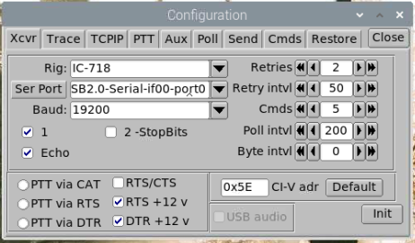
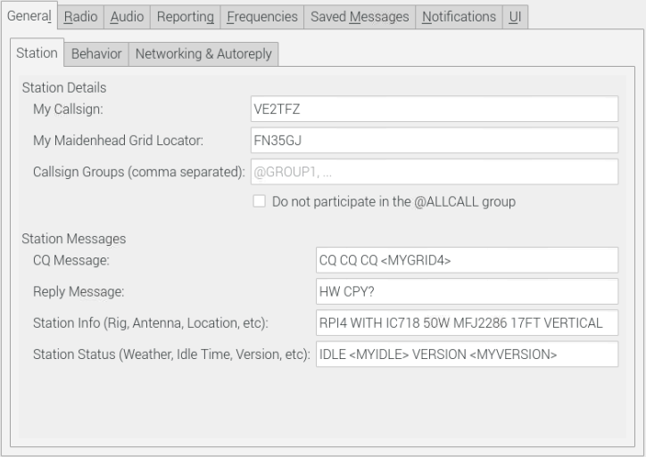
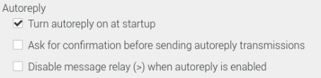

# This is how I build my Raspberry Pi 4 for ham use:

## Flash Raspbian Image

- Use the full raspbian image
    ```
    Raspberry Pi OS (32-bit) with desktop and recommended software
    Image with desktop and recommended software based on Debian Buster
    Version:August 2020
    Release date:2020-08-20
    Kernel version:5.4
    Size:2531 MB
    2020-08-20-raspios-buster-armhf-full.zip
    ```
---
## Configure wifi and enable ssh on first boot
- Create file ```wpa_supplicant.conf``` on boot partition.\
    Content:
    ```
    ctrl_interface=DIR=/var/run/wpa_supplicant GROUP=netdev
    update_config=1
    country=CA

    network={
    ssid="candy"
    psk="###################"
    }
    ```
- Create empy file named ```ssh``` on boot partition
---
## SSH into pi, enable VNC
- ```ssh pi@raspberrypi```\
  (Default hostname, could resolv as raspberrypi.local or raspberrypi.\<localdomain\>)
- Password: ```raspberry```
- ```sudo apt update && sudo apt upgrade -y```
- ```sudo apt clean```
- ```sudo apt autoremove```
- ```sudo reboot```
- ```sudo raspi-config```
    - Change hostname to hampi
    - Enable VNC (Under Interfacing Options)
    - Exit
- ```sudo vi /boot/config.txt```
    ```
    disable_overscan=1

    hdmi_group=2
    hdmi_mode=47
    ```
- Reboot
---
## Connect VNC and configure a few things
- User RealVNC client to connect to hampi.\<localdomain\>
- Go through Setup Wizard
    - Canada
    - Canadian English
    - Toronto
    - Check both check boxes
    - Change User password
    - Select Wifi Network
    - Restart
- Preference, Screen configuration, use full screen resolution
- In RealVNC menu, under Licensing... configure cloud connection
---
## Git
- ```git config --global user.name "Simon"```\
```git config --global user.email "stiffo@gmail.com"```
- git clone https://github.com/sthiffea/hampi.git
    - Use ```git commit -m "reasons"``` to commit changes
    - Use ```git add <filename>``` to add new files
    - Use git push to upload to github
---
## Stuff
- Set background to the image in hampi
---
## GPS
- ```sudo apt -y install gpsd gpsd-clients python-gps chrony```
- ```ls -l /dev/serial/by-id```
    ```
    total 0
    lrwxrwxrwx 1 root root 13 Oct 26 19:18 usb-1a86_USB2.0-Serial-if00-port0 -> ../../ttyUSB0
    lrwxrwxrwx 1 root root 13 Oct 26 19:18 usb-u-blox_AG_-_www.u-blox.com_u-blox_7_-_GPS_GNSS_Receiver-if00 -> ../../ttyACM0
    ```
- ```sudo vi /etc/default/gpsd```
- Make / change to following setting:
    ```
    START_DAEMON=”true”
    USBAUTO=”true”
    DEVICES=”/dev/ttyACM0″
    GPSD_OPTIONS=”-n”
    ```
- ```sudo vi /etc/chrony/chrony.conf```
- Add the following line to the end of the file:
    ```
    refclock SHM 0 offset 0.5 delay 0.2 refid NMEA
    ```
- Reboot
- Check that gpsd and chronyd are active
    ```
    systemctl is-active gpsd
    systemctl is-active chronyd
    systemctl status gpsd
    ```
- Show the gps data:
    ```
    gpsmon -n
    cgps
    xgps
    ```
---
## Real Time Clock
- Enable i2c:
    - ```sudo raspi-config```
    - Enable i2c under Interfacing Options
- Check it is detected:
    ```
    pi@hampi:~ $ sudo i2cdetect -y 1
     0  1  2  3  4  5  6  7  8  9  a  b  c  d  e  f
    00:          -- -- -- -- -- -- -- -- -- -- -- -- --
    10: -- -- -- -- -- -- -- -- -- -- -- -- -- -- -- --
    20: -- -- -- -- -- -- -- -- -- -- -- -- -- -- -- --
    30: -- -- -- -- -- -- -- -- -- -- -- -- -- -- -- --
    40: -- -- -- -- -- -- -- -- -- -- -- -- -- -- -- --
    50: -- -- -- -- -- -- -- -- -- -- -- -- -- -- -- --
    60: -- -- -- -- -- -- -- -- 68 -- -- -- -- -- -- --
    70: -- -- -- -- -- -- -- --
    ```
- ```sudo modprobe rtc-ds1307```
- ```
    sudo su -
    echo ds1307 0x68 > /sys/class/i2c-adapter/i2c-1/new_device
    ```
- ```
    sudo hwclock -r
    date
    sudo hwclock -w
    sudo hwclock -r
    ```
- Add ```rtc-ds1307``` to ```/etc/modules```
- Add script to start RTC in ```sudo vi /etc/rc.local```
    ```
    echo ds1307 0x68 > /sys/class/i2c-adapter/i2c-1/new_device
    sudo hwclock -s
    date
    ```


---
## FLRig
- ```sudo apt-get install -y flrig```
- Config\
    
---
## Fldigi
- ```cd Downloads```
- ```wget http://www.w1hkj.com/files/fldigi/fldigi-4.1.15.tar.gz```
- ```tar zxvf fldigi-4.1.15.tar.gz```
- ```cd fldigi-4.1.15```
- ```./configure --enable-static```
- ```make```
- ```sudo make install```
- ```sudo ldconfig```
---
## JS8Call
- ```sudo apt install libgfortran3 libqt5multimedia5 libqt5multimedia5-plugins libqt5multimediagsttools5 libqt5multimediaquick5 libqt5multimediawidgets5 libqt5qml5 libqt5quick5```
- ```wget http://files.js8call.com/2.2.0/js8call_2.2.0_armhf.deb```
- ```sudo dpkg -i js8call_2.2.0_armhf.deb```
- Config\
    \
    \
    \
    
---
## Conky
- ```sudo apt install -y conky```
- ```cd```
- ```ln -sf hampi/conkyrc
---

