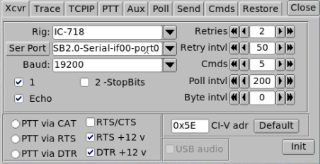

# This is how I build my Raspberry Pi 4 for ham use:

## Flash Raspbian Image

- Use the full raspbian image
    ```
    Raspberry Pi OS (32-bit) with desktop and recommended software
    Image with desktop and recommended software based on Debian Buster
    Version:August 2020
    Release date:2020-08-20
    Kernel version:5.4
    Size:2531 MB
    2020-08-20-raspios-buster-armhf-full.zip
    ```
---
## Configure wifi and enable ssh on first boot
- Create file ```wpa_supplicant.conf``` on boot partition.\
    Content:
    ```
    ctrl_interface=DIR=/var/run/wpa_supplicant GROUP=netdev
    update_config=1
    country=CA

    network={
    ssid="candy"
    psk="###################"
    }
    ```
- Create empy file named ```ssh``` on boot partition
---
## SSH into pi, enable VNC
- ```ssh pi@raspberrypi```\
  (Default hostname, could resolv as raspberrypi.local or raspberrypi.\<localdomain\>)
- Password: ```raspberry```
- ```sudo apt update && sudo apt upgrade -y```
- ```sudo apt clean```
- ```sudo apt autoremove```
- ```sudo reboot```
- ```sudo raspi-config```
    - Change hostname to hampi
    - Enable VNC (Under Interfacing Options)
    - Exit
- ```sudo vi /boot/config.txt```
    ```
    disable_overscan=1

    hdmi_group=2
    hdmi_mode=47
    ```
- Reboot
---
## Connect VNC and configure a few things
- User RealVNC client to connect to hampi.\<localdomain\>
- Go through Setup Wizard
    - Canada
    - Canadian English
    - Toronto
    - Check both check boxes
    - Change User password
    - Select Wifi Network
    - Restart
- Preference, Screen configuration, use full screen resolution
- In RealVNC menu, under Licensing... configure cloud connection
---
## Git
- ```git config --global user.name "Simon"```\
```git config --global user.email "stiffo@gmail.com"```
- git clone https://github.com/sthiffea/hampi.git
    - Use ```git commit -m "reasons"``` to commit changes
    - Use ```git add <filename>``` to add new files
    - Use git push to upload to github
---
## Stuff
- Set background to the image in hampi
---
## FLRig
- ```sudo apt-get install -y flrig```

---
## JS8Call
- ```sudo apt install libgfortran3 libqt5multimedia5 libqt5multimedia5-plugins libqt5multimediagsttools5 libqt5multimediaquick5 libqt5multimediawidgets5 libqt5qml5 libqt5quick5```
- ```wget http://files.js8call.com/2.2.0/js8call_2.2.0_armhf.deb```
- ```sudo dpkg -i js8call_2.2.0_armhf.deb```
---

